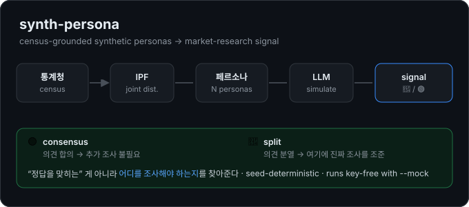

# synth-persona

> 통계청 인구 통계로 만든 **가상 페르소나**에게 시장조사 질문을 던져, 진짜 설문 전에 빠르게 "간"을 보는 오픈소스 도구.
> *Synthetic personas grounded in real Korean census distributions — a fast, cheap "zeroth-draft" market read before you run an actual survey.*

[](https://github.com/Choihello/synth-persona/actions/workflows/ci.yml)   

<p align="center">
  
</p>

---

## 뭐 하는 도구야?

실제 시장조사는 패널 모집에 2주, 수백만 원이 든다. 그래서 **아이디어 초기 단계에선 "방향"만 빠르게 보고 싶을 때**가 많다. `synth-persona`는:

1. **통계청 분포로 현실적인 모집단을 합성**한다 (연령·성별·지역·가구원수가 *함께* 그럴듯하게 — 단순 독립 샘플링이 만드는 "20대 4인가구 가구주" 같은 비현실 조합을 IPF로 억제).
2. 그 페르소나들에게 **LLM으로 질문**을 던진다.
3. 답을 **합의(🟢) / 분열(🔴) 신호 + 세그먼트 교차표**로 집계한다.

핵심은 정답을 맞히는 게 아니라 **"어디를 진짜로 조사해야 하는지"를 찾아주는 것**이다.

## 철학: 신뢰성 = "내가 어디서 틀리는지 아는 능력"

LLM 페르소나는 평균으로 회귀하고, 예스맨 편향이 있고, 고정관념을 연기한다. 그래서 이 도구는 **"다 안다"고 말하지 않는다.** 대신:

- 페르소나 의견이 **갈린 곳(🔴)** 을 표시한다 → *"여기에 진짜 조사 예산을 쓰세요"*
- 합의된 곳(🟢)은 *"추가 조사 불필요"* 로 표시한다
- 세그먼트(연령·지역…)별로 답이 갈리는지를 보여준다 → *전체는 갈려도 "40대 안에선 합의"* 같은 결을 포착

> 🔴/🟢 신호는 버그가 아니라 **제품 그 자체**다. "조사를 대체"하는 게 아니라 "조사를 조준"한다.

## 데모

키 없이 결정적 mock 제공자로 바로 돌려볼 수 있다:

```console
$ node dist/cli/main.js --question "신선식품 새벽배송 구독, 월 9900원에 쓸 의향?" \
    --choices "쓴다,안쓴다" --n 60 --seed 7 --mock

전체 신호: 🔴 split (분산 0.99)
응답 분포: 쓴다=34, 안쓴다=26

[age별]
  🟢 20대 (n=16): 쓴다=16
  🟢 50대 (n=12): 안쓴다=12
  🟢 40대 (n=14): 안쓴다=14
  🟢 30대 (n=18): 쓴다=18

[sex별]
  🔴 남 (n=26): 쓴다=16, 안쓴다=10
  🔴 여 (n=34): 안쓴다=16, 쓴다=18

[region별]
  🔴 수도권 (n=30): 쓴다=17, 안쓴다=13
  🔴 비수도권 (n=30): 쓴다=17, 안쓴다=13

[hh별]
  🔴 1인가구 (n=26): 쓴다=21, 안쓴다=5
  🔴 3인가구 (n=8): 안쓴다=6, 쓴다=2
  🔴 2인가구 (n=19): 안쓴다=11, 쓴다=8
  ⚪ 4인이상 (n=7): 안쓴다=4, 쓴다=3 — 표본 부족, 판단 보류
```

세그먼트 앞의 `(n=X)`는 해당 세그먼트에 응답한 표본 크기다. 기본 `minN=8` 미만이면 색상 신호(🔴/🟢) 대신 ⚪로 판단을 보류한다 — 표본이 적을 때 성급히 결론 내리지 않기 위함이다.

읽는 법: **전체는 🔴 분열**이지만 **연령(age)으로 보면 각 세그먼트가 🟢 합의** — 20·30대는 "쓴다", 40·50대는 "안쓴다". 즉 *"이 서비스의 운명은 연령이 가른다"* 가 한눈에 보인다. (위 출력은 데모용 결정적 mock 결과이고, 실제 인사이트는 Claude 제공자로 얻는다.)

### 통계청 합성 인구로 돌리기 (`--source census`, 키 불필요)

`--source census`를 주면 위 샘플 분포 대신 **번들된 2024 인구총조사 합성 인구**(`data/census/kr-2024.json`, 약 4,346만 명)에서 weight 비례로 표본을 뽑아 돌린다. 성·연령·지역에 더해 **혼인·가구원수** 세그먼트까지 나온다. API 키 없이 결정적 mock으로 재현 가능:

```console
$ node dist/cli/main.js --question "신선식품 새벽배송 구독, 월 9900원에 쓸 의향?" \
    --choices "쓴다,안쓴다" --n 60 --seed 7 --source census --mock

전체 신호: 🔴 split (분산 0.90)
응답 분포: 안쓴다=41, 쓴다=19

[성별]
  🔴 남자 (n=34): 안쓴다=24, 쓴다=10
  🔴 여자 (n=26): 안쓴다=17, 쓴다=9

[연령별]
  ⚪ 15~19세 (n=2): 안쓴다=2 — 표본 부족, 판단 보류
  ⚪ 25~29세 (n=5): 쓴다=5 — 표본 부족, 판단 보류
  ... (연령 15구간 · 혼인 · 가구원수 세그먼트 계속 — 다수는 n<8 소표본으로 ⚪ 표시된다)
```

> 위 숫자는 **synthetic panel response**(가상 패널 응답)이지 실제 구매율·시장 예측이 아니다. census 경로의 페르소나는 provenance(matched/conditioned/inferred)와 weight를 보존하므로, 합성 인구 자기검증은 `npm run reliability:demo`(키 불필요)로 1·2층 신뢰성 카드까지 확인할 수 있다. 실제 응답 추론(2층)은 Claude 제공자를 붙일 때 동작한다.

## 빠른 시작

```bash
git clone https://github.com/Choihello/synth-persona.git && cd synth-persona
npm install
npm run build
```

### 키 없이 바로 돌려보는 4가지 (전부 결정적·재현 가능)

```bash
# 1) 번들 샘플 분포 + mock — 빠른 감 잡기
node dist/cli/main.js --question "A안 vs B안?" --choices "A안,B안" --n 40 --mock

# 2) 통계청 합성 인구(2024 인구총조사) + mock — 성·연령·지역·혼인·가구원수 세그먼트
node dist/cli/main.js --question "월 9900원에 쓸 의향?" --choices "쓴다,안쓴다" \
    --n 60 --seed 7 --source census --mock

# 3) 합성 인구 신뢰성 카드 — 1층 구성 신뢰도 + 2층 속성 provenance (자기검증)
npm run reliability:demo

# 4) 창업자 인사이트 리포트 — 진단(🔴/🟢)을 다음 행동(인터뷰·설문·랜딩 초안)으로 번역
npm run report:demo
```

키 없이도 `npm install && npm test` 가 항상 초록불이다 (테스트·CI는 mock/VCR만 사용). 위 mock 출력의 숫자는 **synthetic panel response**(가상 패널 응답)이지 실제 구매율·시장 예측이 아니다.

### 실제 LLM으로 돌리기 (기본: OpenAI)

```bash
cp .env.example .env   # OPENAI_API_KEY 채우기 (platform.openai.com → API Keys, 크레딧 선불 충전 필요)
node --env-file=.env dist/cli/main.js --question "..." --choices "...,..." --n 30 --source census --repeats 3
```

- 기본 모델은 비용을 고려해 gpt-4o-mini (`OPENAI_MODEL`로 교체 가능). **n=30 1회 ≈ $0.006, 반복 3회 풀링해도 ≈ $0.02** — 콘솔에서 지출 한도를 걸어두면 안전하다.
- Claude를 쓰려면 `--provider anthropic` + `ANTHROPIC_API_KEY` (기본 Haiku).
- 라이브 실행은 선택지 순서를 절반씩 뒤집는 **counterbalance가 기본 on**이다 — 실측에서 LLM의 마지막 선택지 편향(~18%p 과소평가)이 계측되어서다(`docs/b2-live-notes-2026-07-04.md`). 끄려면 `--no-counterbalance`.
- 매 실행 끝에 토큰 사용량 영수증이 출력된다.

**실측→리포트 한 방에** (실측 + LLM 처방 + 13섹션 창업자 리포트):

```bash
npm run report:live -- --question "..." --choices "쓴다,안쓴다" --n 30
```

#### 실사례 (2026-07, gpt-4o-mini, n=300, ~$0.09)

"신선식품 새벽배송 구독, 월 9900원" 질문에서 — 긍정 41.7%로 3만원 반찬배달(22.7%)·5만원 EV 배터리(24.3%)와 뚜렷이 분화했고, **1인가구가 오히려 최대 저항**(긍정 33% vs 5인가구 78%, n=138)이라는 통념 반대 신호가 재현됐다. 리포트는 이걸 "1인분 소비량엔 구독이 비효율인가?"라는 다음 인터뷰 질문으로 번역한다. 상세: `docs/b1-live-notes-2026-07-04.md`.

### 실제 통계청 데이터(KOSIS)로

`.env`에 `KOSIS_API_KEY`를 넣고(kosis.kr 활용신청 → 자동승인 즉시 발급) 라이브러리에서 `KosisSource`를 쓰면, 번들 샘플 대신 실제 인구총조사 교차표로 페르소나를 만든다:

```ts
import { KosisSource, runStudy, ClaudeProvider } from "synth-persona";

const source = new KosisSource({
  apiKey: process.env.KOSIS_API_KEY!,
  tblId: "DT_1JC1511",          // 인구총조사: 가구주 연령 × 가구원수
  orgId: "101", objL1: "00",    // 전국 (40,000셀 한도 회피)
  objL2: "ALL", itmId: "ALL",
  newEstPrdCnt: 1,              // 최신 1개 기간 (다연도 합산 방지)
  rowDim: { name: "연령", keys: ["25~29세", "40~44세", /* ... */] },
  colDim: { name: "가구원수", keys: ["가구원수 1명", "가구원수 4명", /* ... */] },
  rowAxis: "c2nm",             // 연령은 분류축
  colAxis: "item",             // 가구원수는 항목축(ITM_NM)
});
const result = await runStudy({ source, provider: new ClaudeProvider(), question: { /* ... */ }, n: 100 });
```

> 표마다 축 인코딩이 다르다 — 어떤 표는 한 축을 분류(C1/C2)가 아니라 **항목(ITM_NM)**으로 둔다. `rowAxis`/`colAxis`로 지정한다. 비공표값(`X`)·결측(`-`)은 자동으로 null 처리된다.

### CLI 옵션

| 플래그 | 설명 | 기본값 |
|---|---|---|
| `--question` | 던질 질문 (필수) | — |
| `--choices` | 상대 비교 선택지 `"A,B"` | 없음(자유응답) |
| `--n` | 페르소나 수 | 50 |
| `--seed` | 재현용 시드 (정수) | 1 |
| `--source` | `sample` (번들 샘플 분포) 또는 `census` (번들 통계청 합성 인구). KOSIS 라이브는 라이브러리 전용 | sample |
| `--mock` | 키 없이 결정적 mock | off |
| `--provider` | `openai` 또는 `anthropic` | openai |
| `--concurrency` | 실측(비-mock) 시 동시 LLM 호출 수 | 4 |
| `--repeats` | 반복 실행 풀링 (run간 분산 완화, 실측 3 권장) | 1 |
| `--no-counterbalance` | 선택지 순서 상쇄 해제 (라이브 기본 on) | — |
| `--help` | 도움말 | — |

## 웹 서비스 (web/)

질문 하나 입력 → 진행 표시 → 리포트 + 공유 링크(`/r/<id>`)를 제공하는 호스팅 웹 (방문자 키 불필요, IP당 일 3회 + 전역 일일 상한).

```bash
npm run web:dev            # localhost:8787 (.env의 OPENAI_API_KEY 사용)
```

배포는 Dockerfile + fly.toml 참조 (secrets: `OPENAI_API_KEY`, `IP_SALT`; 볼륨에 SQLite). 상세 설계: `docs/superpowers/specs/2026-07-04-web-v1-design.md`.

## 동작 원리

```
DataSource (통계청 샘플/KOSIS)
   └─ 주변분포 + 2-way 교차표
        ↓  IPF (반복비례조정)
   결합분포 텐서 ── 변수 간 상관 보존
        ↓  시드 샘플링
   페르소나 N명 (연령·성별·지역·가구…)
        ↓  LLMProvider (Claude / Mock / VCR)
   페르소나별 응답
        ↓  집계 (정규화 엔트로피)
   🔴/🟢 전체 신호 + 세그먼트 교차표
```

라이브러리로도 쓸 수 있다:

```ts
import { runStudy, SampleSource, ClaudeProvider } from "synth-persona";

const result = await runStudy({
  source: new SampleSource(),
  provider: new ClaudeProvider(),       // 또는 MockProvider / RecordedProvider
  question: { prompt: "이 컨셉 어때요?", choices: ["끌린다", "안 끌린다"] },
  n: 100,
  seed: 42,
});

console.log(result.signal);     // "consensus" | "split"
console.log(result.bySegment);  // 세그먼트별 신호 + 분포
```

## 왜 "그냥 GPT 래퍼"가 아닌가 — 검증

이 프로젝트는 **자기 자신을 검증한다.** 현재 포함된 것:

- **IPF 불변식 (property test)** — 무작위 분포에서 마진 항상 복원, 결합분포 합=1, 상관 보존을 `fast-check`로 검증
- **결정성** — 같은 시드 → 같은 결과 (파이프라인 전 구간 테스트)
- **VCR(녹화/재생) LLM** — 실제 Claude 응답을 한 번 녹화 후 재생 → 테스트가 무료·결정적·무네트워크
- **키 없는 결정적 CI** — `lint + test + build` 게이트 (`@anthropic-ai/sdk` 외 런타임 의존성 0)
- **캘리브레이션 성적표** — 결과를 아는 과거 사례에 백테스트해 *fidelity*(순위상관·MAE·방향정확도)를 내고 마크다운 report card로 렌더 (`npm run calibrate:demo`)
- **능동 편향/강건성 점검** — 예스맨·평균회귀·자기일관성 탐침, 패러프레이즈·선택지 순서·속성 민감도 섭동 검사, 결정성/예산/드리프트 거버넌스 → ✅/⚠️ 하네스 성적표
- **뮤테이션 테스트** — Stryker로 순수 코어에 버그를 심어 "테스트가 진짜 버그를 잡는지" 점수화 (`npm run test:mutation`)
- **합성 인구 fidelity** — 합성 모집단을 통계청 원본 대비 가중 재집계해 MAE/TVD로 "1층(인구학) 신뢰"를 숫자화하고, matched(실측)와 conditioned(추정) 변수를 분리 표기 (`npm run fidelity:demo`)

> 위 데모의 핵심 버그(부분문자열 선택지 오매칭)도 실제 CLI를 돌려보다 발견해 고쳤다 — 정적 검사가 아니라 실행·관찰로.

## 한계 (정직하게)

가상 페르소나가 **할 수 없는 것**:
- 구매전환율·가격탄력성 같은 **정량 예측** (절대 수치는 믿지 말 것 — 상대 순위만)
- LLM 학습 시점 이후의 **신제품/신트렌드** 반응
- 소수의견·극단값 (평균으로 뭉개짐)

쓸모 있는 곳: **탐색적 정성조사, A/B 상대 비교, 세그먼트별 태도의 결, 설문 사전 점검** — 즉 "진짜 조사 전에 가설을 좁히는" 0차 단계.

## 로드맵

- [x] **코어 엔진** — IPF · 페르소나 샘플링 · LLM 시뮬 · 불확실성 집계 · CLI (Plan 1)
- [x] **검증 — 채점·캘리브레이션·성적표** — fidelity 점수(순위상관/MAE/방향정확도) + 마크다운 report card (`npm run calibrate:demo`) (Plan 2A)
- [x] **검증 — 능동 점검** — 편향 탐침(예스맨/평균회귀/자기일관성) · 강건성(패러프레이즈/순서편향/속성민감도) · 거버넌스(결정성/예산/드리프트) · 뮤테이션 테스트(`npm run test:mutation`, 코어 ~79%) (Plan 2B)
- [x] **라이브 KOSIS 연동 (라이브러리)** — 통계청 인증키로 실제 인구총조사 교차표(예: `DT_1JC1511` 가구주 연령×가구원수) 사용. `KosisSource`가 항목축 매핑·비공표값(`X`/`-`)·기간 제약(`newEstPrdCnt`) 처리. (CLI `--source kosis` 노출은 추후)
- [x] **검증된 합성 인구 (Plan 3A)** — 통계청 다표 융합으로 5속성 페르소나: 성×연령×권역 *matched-core* + 혼인·가구원수 *연령 앵커 조건부 부착*(완전 5-way joint 아님). 가중 모집단(`weight`)·provenance(matched/conditioned/inferred)·frame 가드·householder bridge 명시. 실제 2024 인구총조사 스냅샷(`data/census/`, 약 4,346만 명) 번들 — 키 없이 재현.
- [x] **합성 인구 fidelity 리포트 (Plan 3B)** — 합성 집단을 원본 대비 가중 재집계(MAE/TVD/smoothedKL)해 "1층 신뢰"를 숫자로. matched-core vs conditioned 분리, `npm run fidelity:demo` (실 스냅샷 core/conditional 전부 MAE≈0)
- [x] **신뢰성 오버레이 (묶음 A)** — `StudyResult`에 4층 신뢰성 카드(1층 구성·2층 속성 provenance·3층 응답[placeholder]·4층 부정형 가드레일) 결합. provenance worst-wins 보수 집계, 숫자는 synthetic panel response로 라벨. `npm run reliability:demo` (키 불필요)
- [x] **key-free census 파이프라인 (B0)** — `runCensusStudy`/`censusShareRunner` 공개 헬퍼 + CLI `--source census`로 번들 통계청 합성 인구를 키 없이 실행. probes/robustness를 provider 추상화 위에 배선(현재 mock로 검증)
- [x] **창업자 인사이트 리포트 (Plan 4, heuristic v1)** — 진단을 창업자 행동으로 번역: 기회/저항 세그먼트 랭킹(+판단 보류) · 4층 신뢰도 카드 · heuristic 처방(인터뷰 대상/질문·설문·랜딩·7일 플랜, 전부 "AI 생성 초안" 라벨) · markdown 렌더 (`npm run report:demo`, 키 불필요). LLM 생성 v2는 issue #4.
- [x] **2층 응답 실측 (묶음 B)** — B1 완료(go 조건부, gpt-4o-mini · `--provider openai|anthropic`): 예스맨·순서 편향 게이트 통과, 가격 저항 분화 확인 ([노트](docs/b1-live-notes-2026-07-04.md))
- [x] **3층 응답 신뢰도 실측 (묶음 B)** — `measureResponseConsistency` + `npm run b2:live`로 자기일관성·예스맨·순서·패러프레이즈·붕괴 계측, `responseConsistency`가 measured(medium|low)로 교체됨. 실측(gpt-4o-mini): 순서·문구 민감 → low ([노트](docs/b2-live-notes-2026-07-04.md))
- [x] **진단→처방: 다음 행동 생성물 (묶음 B)** — B3 완료: `buildLLMPrescriptions`가 실측 reason 층화 샘플에 근거해 drivers/objections(병목 태그)/인터뷰 질문을 LLM 생성(basis:llm), 나머지는 heuristic 위임. `npm run report:live`로 end-to-end ([노트](docs/b3-live-notes-2026-07-04.md), issue #4)
- [ ] 웹 UI

## 라이선스

MIT

### 데이터 출처·표기

- 페르소나 배경 서사: [NVIDIA Nemotron-Personas-Korea](https://huggingface.co/datasets/nvidia/Nemotron-Personas-Korea) (CC BY 4.0) — `NARRATIVE=on`일 때 롤플레이 프롬프트에만 사용
